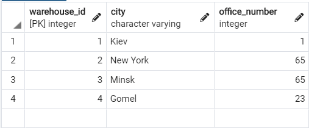
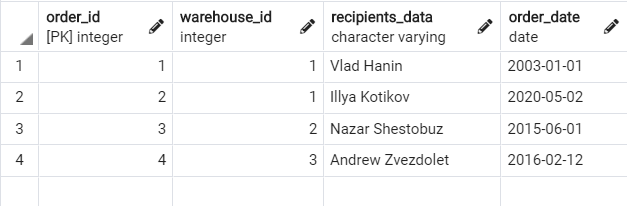
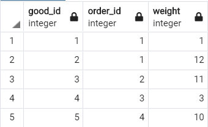

# Лабораторна робота No 2. Засоби оптимізації роботи СУБД PostgreSQL

## Варіант 3

## Предметна галузь

Доставка вантажів

## ER-діаграма

## Таблиці

### warehouses

### orders

### goods

## Опис структури бази даних

| Таблиця | Атрибути | Типи даних |
|------------|---------|--------------------|
| _Таблиця "**warehouses**"_   Вміщує інформацію про склади, між якими транспортуються вантажі | _warehouse_id_ — ідентифікатор складу  _city_ — місто складу   _office_number_ — номер відділення | Числовий   Текстовий   Числовий
| _Таблиця "**orders**"_   Вміщує інформацію про транспортні накладні | _order_id_ — ідентифікатор накладної   _warehouse_id_ — ідентифікатор складу до якого прямує посилка  _recipients_data_ — дані отримувача   _order_date_ — дата прибуття | Числовий   Числовий   Текстовий   Дата |
| _Таблиця "**goods**"_   Вміщує інформацію предмети, що доставляються | _good_id_ — ідентифікатор предмета  _order_id_ — ідентифікатор накладної, якій належить предмет   _weight_ — вага предмету | Числовий   Числовий   Числовий
